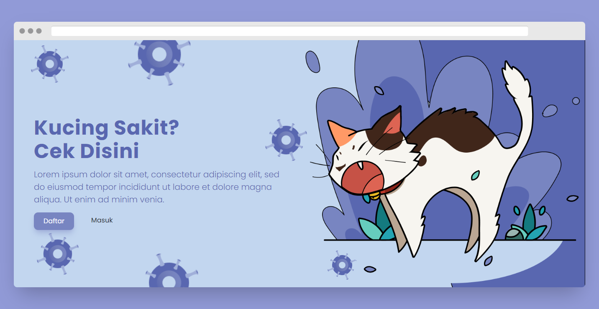

<p align="center">

</p>
<p align="center">
<a href="#"></a>
</p>
<p align="center">
<a href="https://github.com/nizarfadlan"></a>
</p>
<p align="center">
<a href="https://github.com/nizarfadlan/followers"></a>
<a href="https://github.com/nizarfadlan/cat-disease-diagnosis/stargazers/"></a>
<a href="https://github.com/nizarfadlan/cat-disease-diagnosis/network/members"></a>
<a href="https://github.com/nizarfadlan/cat-disease-diagnosis/watchers"></a>
<a href="https://hits.seeyoufarm.com"></a>
</p>
<div align="center">
<details>
 <summary>🥟 Help me!</summary>
 <p align="center">
    <a href="https://trakteer.id/nizariyf" target="_blank"></a>
    <a href="https://paypal.me/niyf1" target="_blank"></a>
 </p>

</details>

don't forget ⭐️ :D
  <p align="center">
    <a href="https://instagram.com/nizariyf_/" target="_blank"></a>
    <a href="https://nizarfadlan.dev" target="_blank"></a>
  </p>
</div>

## Cat Disease Diagnosis


This is an expert system program with the Dempster Shafer method created on a website using the PHP programming language. This expert system is to determine what disease in cats is through the symptoms suffered.

## Getting Started

This project require PHP and MySQL.

### Install
Clone this project

```bash
> git clone https://github.com/nizarfadlan/cat-disease-diagnosis.git
> cd cat-disease-diagnosis
> run web server and redirect path localhost to project
```

### Set up database
Import database to your MySQL

```bash
> create database dempster_shafer
> import backup/dempster_shafer.sql to your MySQL
> edit file modules/koneksi.php
```

---

## Account
### User admin
  > Username: admin
  > Password: admin
### User
  > Username: test
  > Password: test

---

## Features

| User |Yes|
| ------------- | ------------- |
| Change username |✅|
| Change name |✅|
| Change password |✅|
| View diagnosis history and print history result |✅|

| Admin |Yes|
| ------------- | ------------- |
| Change username |✅|
| Change name |✅|
| Change password |✅|
| Add disease |✅|
| Add symptoms |✅|
| Add to the relationship between disease and symptoms |✅|
| View diagnosis history and print history result users |✅|

> **_NOTE:_**  Sorry this code is very messy because i only use it for learning and its use is not for production only study so sorry if the code is not clean or messy.

---

## Thanks to
- Haidar Ikram Ramadhan (UI)
